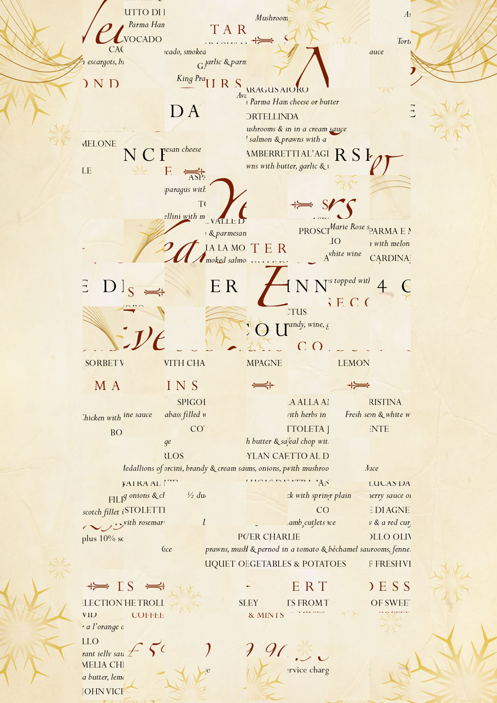

# Part 1
Use the 7 characters we know at the start of the flag, `blahaj{` to partially unscramble the image vertically.

This is done in part1.py

Now solve some part of the puzzle on the bottom half of the image (except the left column) to get some text, a name or a description of a dish.

`"porcini, brandy & cream sauce"` and `"POLLO OLIVER CHARLIE"` are two possible searches that bring up the restaurant. (with quotation marks)

### Alternatively, skip the unscrambling and just gather enough words that the restaurant pops up

`"A LA", "with melon", "parma ham", "escargots", "smoked salmon", "& parmesan"` will bring up the restaurant when searched. There are probably many other ways since the osint part of this chall is not hard

# Part 2

For every piece in the original image, find the new horizontal position and then new vertical position to gather modulus data (this is the rev part of this challenge and can be a bit frustrating)

Done in solve.py

#### blahaj{h4PpY_nEw_y3aR_My_Fr13ND}